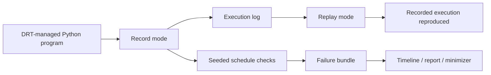

# DRT

Deterministic concurrency testing and record/replay runtime for DRT-instrumented Python code.

DRT is a focused debugging and testing runtime for concurrency bugs in Python code that explicitly uses DRT-managed threads, synchronization primitives, and nondeterministic APIs. It can record scheduler decisions and selected runtime inputs, replay the same recorded execution, and run a target across seeded schedules to find reproducible failures.

This project is intentionally narrow in scope. It is not a transparent debugger for arbitrary `threading` programs, and it does not monkey-patch the standard library to pretend otherwise.

## What It Does

- records DRT-managed thread scheduling decisions
- records thread lifecycle and join completion events
- captures selected nondeterministic inputs such as time, random values, and file reads
- replays the recorded execution in strict event order
- detects replay drift instead of silently continuing
- runs repeated seeded schedule checks for a target callable
- writes failure bundles with a trace, failure report, environment metadata, source hashes, and schedule choices
- provides log inspection, trace explanation, HTML reporting, and integrity verification commands

## Current Status

DRT is an advanced prototype with a serious test and verification surface. The current direction is deterministic concurrency testing: find a bad interleaving, preserve it as a failure bundle, inspect it, and replay or minimize the schedule. It should not be described as a drop-in production debugger for general Python concurrency.

## Supported Model

DRT is designed for code that opts into the DRT API:

- `DRTThread`
- `DRTMutex`
- `DRTCondition`
- `DRTSemaphore`
- `DRTBarrier`
- `runtime_yield()`
- `drt_time()`, `drt_random()`, `drt_seed()`
- `drt_read_file()` and `drt_read_text()`

If a code path bypasses these APIs and uses the standard library directly, DRT does not guarantee replay for that path.

## Installation

### From source

```bash
pip install -e .[dev]
```

### Requirements

- Python 3.9+

## Quick Start

### Record a buggy execution

```python
from drt import DRTRuntime, DRTThread, runtime_yield


def buggy_program():
    counter = [0]

    def worker():
        for _ in range(100):
            snapshot = counter[0]
            runtime_yield()
            counter[0] = snapshot + 1

    threads = [DRTThread(target=worker) for _ in range(3)]
    for thread in threads:
        thread.start()
    for thread in threads:
        thread.join()

    return counter[0]


runtime = DRTRuntime(mode="record", log_path="bug.log")
recorded = runtime.run(buggy_program)
print("recorded:", recorded)
```

### Replay the same execution

```python
runtime = DRTRuntime(mode="replay", log_path="bug.log")
replayed = runtime.run(buggy_program)
print("replayed:", replayed)
```

If replay no longer matches the recorded execution, DRT raises `DivergenceError`.

## CLI

DRT exposes CLI commands for logs, schedule checks, failure bundles, and trace reports:

```bash
drt info bug.log
drt verify bug.log
drt dump bug.log
drt check mymodule:my_test --runs 100 --strategy random --seed 1
drt check mymodule:my_test --strategy exhaustive --depth 4 --branching 2
drt check mymodule:my_test --strategy stress --runs 1000 --stress-max-runs 200
drt replay .drt/failures/failure-...
drt timeline .drt/failures/failure-...
drt explain .drt/failures/failure-...
drt report .drt/failures/failure-... --output trace.html
drt minimize .drt/failures/failure-... mymodule:my_test
```

- `drt info` shows basic log metadata
- `drt verify` validates structure, completion metadata, and current-format integrity checks
- `drt dump` renders the log in a readable form for inspection
- `drt check` runs a callable repeatedly under seeded record-mode schedules and writes a failure bundle on the first failing run
- `drt replay` re-runs a failure bundle target with stored schedule choices and reports source drift
- `drt timeline` and `drt explain` summarize a log or failure bundle
- `drt report` writes a standalone HTML trace report
- `drt minimize` attempts to shrink stored schedule choices while preserving the failure

Pytest integration is also available:

```bash
pytest --drt --drt-runs 100 --drt-strategy random
pytest --drt --drt-strategy exhaustive --drt-depth 4 --drt-branching 2
```

The package registers a `pytest11` entry point when installed. In a source tree
without installation, load it explicitly with `pytest -p drt.pytest_plugin`.

Tests can also opt in with a decorator:

```python
from drt import drt_test


@drt_test(schedules=1000, strategy="random", seed=1)
def test_counter():
    ...
```

The pytest plugin uses the same schedule planner as `drt check`, including
`round_robin`, `random`, `exhaustive`, `priority`, and `stress` modes.

Current logs include format-versioned completion metadata and a CRC32 over the serialized event body. That is an integrity check, not cryptographic authenticity.

## How It Works



At a high level:

1. Managed threads run only when the scheduler grants permission.
2. Yield points define where interleavings can happen.
3. Record mode logs scheduling decisions and supported nondeterministic inputs.
4. Replay mode consumes the log in strict order.
5. Check mode varies record-mode schedules using stable seeds.
6. If a target fails, DRT packages the trace and metadata for inspection.
7. If the next replay event does not match, replay fails immediately.

## Evidence

The repository includes runnable proof points, not just API docs:

- [tests/test_runtime.py](tests/test_runtime.py): regression suite, replay checks, integrity checks, and invariant-style randomized coverage
- [tests/test_checker.py](tests/test_checker.py): check-runner and failure-bundle coverage
- [tests/test_trace.py](tests/test_trace.py): trace timeline, explanation, and HTML report coverage
- [tests/test_schedule_exploration.py](tests/test_schedule_exploration.py): seeded random and scripted schedule policy coverage
- [tests/test_minimize.py](tests/test_minimize.py): schedule-choice minimization helper coverage
- [tests/test_race_condition.py](tests/test_race_condition.py): end-to-end lost-update replay script
- [benchmarks/benchmark_drt.py](benchmarks/benchmark_drt.py): small benchmark covering plain execution, record, and replay
- [docs/CASE_STUDY_LOST_UPDATE.md](docs/CASE_STUDY_LOST_UPDATE.md): concrete bug-capture to replay to fix walkthrough

## Running The Project

```bash
python tests/test_runtime.py
python -m unittest discover -v
python tests/test_race_condition.py
python benchmarks/benchmark_drt.py
```

Contributor workflow and build/release checks are documented in [CONTRIBUTING.md](CONTRIBUTING.md).

## Documentation

- [docs/README.md](docs/README.md): documentation index
- [docs/USER_GUIDE.md](docs/USER_GUIDE.md): practical usage guide
- [docs/API_REFERENCE.md](docs/API_REFERENCE.md): public API reference
- [docs/ARCHITECTURE.md](docs/ARCHITECTURE.md): design and component overview
- [docs/SPECIFICATION.md](docs/SPECIFICATION.md): formal behavior model
- [DESIGN.md](DESIGN.md): design rationale and tradeoffs

## Limitations

### In scope

- single-process Python programs
- DRT-managed threads and synchronization primitives
- explicit, opt-in nondeterminism interception
- seeded schedule exploration for DRT-managed code
- failure bundles and trace reports for recorded DRT executions
- bundle replay with source-hash drift detection
- opt-in DRT-managed async task scheduling through `DRTAsyncRuntime`
- deterministic replay inside the supported DRT API surface

### Out of scope

- arbitrary `threading.Thread` programs without instrumentation
- transparent runtime monkey-patching
- multiprocess or distributed replay
- networking, subprocess orchestration, and signals
- native extensions that bypass the DRT control model
- transparent `asyncio` event-loop replacement for arbitrary async libraries

## Repository Layout

```text
drt/
|-- drt/           # runtime implementation
|-- tests/         # regression and replay tests
|-- benchmarks/    # runnable benchmark scripts
|-- demo/          # demos and walkthrough scripts
|-- docs/          # user, API, architecture, and spec docs
|-- DESIGN.md
|-- CONTRIBUTING.md
|-- README.md
`-- setup.py
```

## License

MIT
