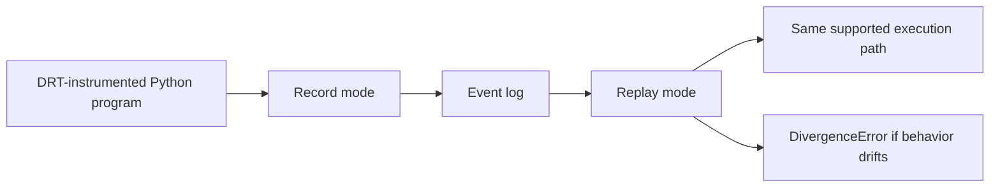

# DRT

Deterministic record-and-replay runtime for DRT-instrumented Python concurrency code.

<p align="left">
  <a href="#why-this-project-is-interesting">Why it matters</a> |
  <a href="#quick-start">Quick start</a> |
  <a href="#how-drt-works">How it works</a> |
  <a href="#evidence">Evidence</a> |
  <a href="#api-surface">API surface</a> |
  <a href="#limitations-and-non-goals">Limitations</a> |
  <a href="#project-layout">Project layout</a>
</p>

> Status
>
> DRT is a focused systems project and a strong prototype. It can deterministically record and replay executions that stay inside the DRT API surface. It is not a drop-in debugger for arbitrary Python threading code, and it does not monkey-patch the standard library.

## Why This Project Is Interesting

Concurrency bugs are hard because they are timing-sensitive:

```text
Run 1: works
Run 2: fails
Run 3: works again
Run 4: fails only after adding debug prints
```

That makes debugging painful. The execution you need disappears as soon as you try to observe it.

DRT attacks that problem by controlling scheduling and recording the execution decisions that matter:

- thread scheduling decisions
- thread lifecycle events
- join completion events
- mutex and condition interactions
- selected nondeterministic inputs such as time, random values, and file reads

Then DRT replays the same execution and fails loudly if the replayed program drifts from the recording.

## What DRT Actually Is

DRT is best understood as:

> a deterministic runtime for Python programs that explicitly opt into DRT-managed threads, locks, conditions, and nondeterministic APIs.

That narrow scope is intentional. It keeps the system understandable, testable, and honest.

## Quick Start

### 1. Install

```bash
pip install -e .
```

### 1b. Inspect and verify a recorded log

```bash
drt info bug.log
drt verify bug.log
drt dump bug.log
```

`drt verify` checks that the log parses cleanly, ends with `LOG_COMPLETE`,
and, for current logs, that the recorded CRC32 matches the serialized event
body. That is integrity checking, not cryptographic authenticity.

### 2. Record a buggy execution

```python
from drt import DRTRuntime, DRTThread, runtime_yield


def buggy_program():
    counter = [0]

    def worker():
        for _ in range(100):
            snapshot = counter[0]
            runtime_yield()  # Intentional race window
            counter[0] = snapshot + 1

    threads = [DRTThread(target=worker) for _ in range(3)]
    for thread in threads:
        thread.start()
    for thread in threads:
        thread.join()

    return counter[0]


runtime = DRTRuntime(mode="record", log_path="bug.log")
recorded = runtime.run(buggy_program)
print("recorded:", recorded)
```

### 3. Replay the same execution

```python
runtime = DRTRuntime(mode="replay", log_path="bug.log")
replayed = runtime.run(buggy_program)
print("replayed:", replayed)
```

If the replayed execution does not match the recording, DRT raises `DivergenceError` instead of silently continuing.

## How DRT Works



At a high level:

1. Managed threads only run when the scheduler gives permission.
2. Yield points define where thread interleavings can happen.
3. Record mode logs scheduler decisions and supported nondeterministic inputs.
4. Replay mode consumes that log in strict order.
5. If the next event does not match, replay stops with an error.

See [DESIGN.md](DESIGN.md) for the design rationale and the tradeoffs behind the explicit API model.

## API Surface

| Standard library idea | DRT API |
| --- | --- |
| `threading.Thread` | `DRTThread` |
| `threading.Lock` | `DRTMutex` |
| `threading.Condition` | `DRTCondition` |
| `time.time()` | `drt_time()` |
| `random.random()` | `drt_random()` |
| `random.seed()` | `drt_seed()` |
| file reads | `drt_read_file()` / `drt_read_text()` |

### Core runtime

```python
from drt import DRTRuntime

runtime = DRTRuntime(mode="record", log_path="execution.log")
result = runtime.run(my_program)

runtime = DRTRuntime(mode="replay", log_path="execution.log")
result = runtime.run(my_program)
```

### Threading and scheduling

```python
from drt import DRTThread, runtime_yield


def worker():
    print("step 1")
    runtime_yield()
    print("step 2")


thread = DRTThread(target=worker)
thread.start()
thread.join()
```

### Synchronization

```python
from drt import DRTMutex, DRTCondition, DRTSemaphore, DRTBarrier

mutex = DRTMutex()
cond = DRTCondition(mutex)
sem = DRTSemaphore(2)
barrier = DRTBarrier(3)
```

### Nondeterminism capture

```python
from drt import drt_time, drt_random, drt_seed, drt_read_file

drt_seed(123)
timestamp = drt_time()
value = drt_random()
data = drt_read_file("input.txt")
```

## Run The Project

```bash
python tests/test_runtime.py
python -m unittest discover -v
python tests/test_race_condition.py
python benchmarks/benchmark_drt.py
```

The main regression suite lives in [tests/test_runtime.py](tests/test_runtime.py).
Contributor workflow and build/release checks live in [CONTRIBUTING.md](CONTRIBUTING.md).

## Evidence

- [docs/CASE_STUDY_LOST_UPDATE.md](docs/CASE_STUDY_LOST_UPDATE.md): a concrete bug-capture -> replay -> fix story grounded in this repo
- [tests/test_race_condition.py](tests/test_race_condition.py): a runnable replay script for the lost-update scenario
- [benchmarks/README.md](benchmarks/README.md): benchmark notes and how to run the current runtime-overhead check

## Interactive Tour

<details>
<summary><strong>What replay validates today</strong></summary>

- strict event ordering
- scheduled thread identity
- join target identity and completion mode
- condition wake ordering within the recorded trace
- file-read path and requested size
- replay completeness at the end of execution
- checksum-backed log completion metadata for current log format

</details>

<details>
<summary><strong>What makes this a good systems project</strong></summary>

- custom scheduler instead of standard thread execution
- explicit event log format
- runtime-managed concurrency primitives
- divergence detection instead of best-effort replay
- bounded scope with clear non-goals

</details>

<details>
<summary><strong>Where to look first in the codebase</strong></summary>

- [drt/runtime.py](drt/runtime.py): runtime lifecycle and orchestration
- [drt/scheduler.py](drt/scheduler.py): deterministic scheduling and replay validation
- [drt/thread.py](drt/thread.py): managed thread lifecycle and join behavior
- [drt/sync.py](drt/sync.py): mutexes, conditions, semaphores, barriers
- [drt/intercept.py](drt/intercept.py): time, random, and file-read interception
- [tests/test_runtime.py](tests/test_runtime.py): regression coverage

</details>

## Limitations And Non-Goals

### In scope

- single-process Python programs
- DRT-managed threads and synchronization primitives
- explicit, opt-in nondeterminism interception
- deterministic replay inside the supported DRT API surface

### Out of scope

- arbitrary `threading.Thread` programs with no instrumentation
- transparent monkey-patching of the Python runtime
- multiprocess or distributed replay
- signals, networking, and external process orchestration
- native extensions that bypass the DRT control model

If a program uses the standard library directly instead of the DRT API, DRT does not and should not pretend to guarantee replay for that code path.

## Project Layout

```text
drt/
|-- drt/
|   |-- __init__.py
|   |-- context.py
|   |-- events.py
|   |-- exceptions.py
|   |-- intercept.py
|   |-- log.py
|   |-- runtime.py
|   |-- scheduler.py
|   |-- sync.py
|   `-- thread.py
|-- tests/
|   |-- __init__.py
|   |-- test_race_condition.py
|   `-- test_runtime.py
|-- benchmarks/
|-- demo/
|-- docs/
|-- DESIGN.md
|-- README.md
`-- setup.py
```

## Why Someone Would Notice This Project

This is not another CRUD app or wrapper around an API. DRT shows:

- runtime and scheduler design
- binary log thinking
- concurrency debugging instincts
- willingness to work in hard, failure-prone territory
- discipline around scope and invariants

If you want a project that signals systems depth instead of surface-level app work, this is the right kind of repo.

## License

MIT
